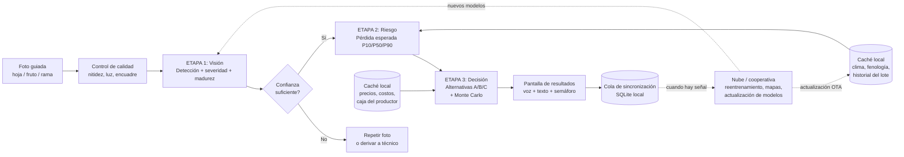

# Plan integral: "Agrónomo de Bolsillo" (Propuesta 1)

**App offline para caficultores: foto → detección → riesgo de pérdida → alternativas con costos ocultos**
Preparado por el Consejo Asesor de Élite, Innovación y Desarrollo Estratégico · Octubre 2026

> **Nota de rigor.** Las referencias del final fueron verificadas en búsquedas durante esta conversación. Las metas numéricas (KPIs, umbrales) son **propuestas a validar con datos propios**, no resultados publicados. Varias fuentes son preprints o documentos técnicos de terceros; úsalas como pista, no como prueba de rendimiento.

---

## 1. Resumen ejecutivo

| Pregunta | Respuesta |
|---|---|
| **Qué es** | Una app Android-first que funciona 100 % sin internet. El caficultor toma una foto; el teléfono detecta la enfermedad o plaga y su severidad, estima la pérdida esperada, y compara alternativas (A, B, C) con su costo directo y sus costos ocultos. |
| **Arquitectura** | Tres modelos en cascada: (1) red neuronal de visión, (2) ML de riesgo de pérdida, (3) ML + simulación para el pronóstico financiero de cada alternativa. |
| **Qué es preentrenado y qué no** | La visión se apoya en modelos y datasets públicos, pero **requiere ajuste con fotos de café colombiano**. Los modelos de riesgo y decisión **no existen preentrenados**: son el activo propio del proyecto. |
| **Cuello de botella real** | No es el modelo. Son las **etiquetas de pérdida real por lote** (cuánto se cosechó realmente) emparejadas con las fotos. |
| **Quién paga** | El caficultor no paga. Pagan cooperativas, exportadoras, aseguradoras, bancos y compradores con metas de sostenibilidad (ver sección 12). |

---

## 2. Principios de diseño

1. **Offline-first real.** Todo lo necesario para la decisión (modelos, clima reciente, tabla de precios, costos locales) vive en el teléfono. La conectividad solo sincroniza y actualiza.
2. **Incertidumbre visible.** Nunca un número solo: siempre rangos (P10/P50/P90) y un nivel de confianza.
3. **El modelo de lenguaje no diagnostica.** Solo verbaliza lo que producen los modelos 1 a 3 (en v1 ni siquiera es necesario: se usan plantillas).
4. **El productor edita los supuestos.** Jornal, tasa de endeudamiento, precio esperado: son editables.
5. **Apoyo a la decisión, no sustituto del técnico.** Si la confianza es baja, la app deriva a un humano.
6. **Se aprende con cada foto.** Todo diagnóstico queda registrado (con consentimiento) para reentrenar.

---

## 3. Arquitectura general



### Capas técnicas

| Capa | Opciones | Recomendación |
|---|---|---|
| **Cliente móvil** | Kotlin nativo, Flutter, React Native | **Android-first** (supuesto a validar con las cooperativas). Flutter o Kotlin con TFLite/ONNX Runtime Mobile. |
| **Inferencia en dispositivo** | TensorFlow Lite, ONNX Runtime Mobile, ExecuTorch | **TFLite o ONNX** para visión y XGBoost/LightGBM; motores como llama.cpp/Cactus para el modelo de lenguaje (fase 2). |
| **Almacenamiento local** | SQLite | Fotos comprimidas, resultados, cola de sincronización, caché de clima y precios. |
| **Backend** | Cualquier nube | API de sincronización, almacenamiento de fotos, pipeline de entrenamiento (MLOps), tablero para cooperativas. |
| **MLOps** | MLflow / DVC / equivalentes | Versionado de datos y modelos; despliegue en "modo sombra" antes de activar un modelo nuevo. |

---

## 4. Flujo de trabajo end-to-end (lo que ocurre en cada toque)

### Paso 0. Perfil del lote (una vez, y se actualiza)
Variedad, edad, altitud, área, sombrío, fecha de última poda y fertilización, **etapa fenológica**, historial de problemas, y si el año es de **carga alta o baja** (la bianualidad influye en la severidad de enfermedades).

### Paso 1. Captura guiada
- Pantalla con guía visual (silueta de hoja/fruto/rama), indicador de luz y nitidez.
- **Protocolo de muestreo:** n fotos por lote en puntos definidos (p. ej. 5 plantas en zigzag) para no depender de una sola foto.
- Control de calidad automático: si está borrosa o muy oscura, pide repetir.

### Paso 2. Etapa 1, Visión (red neuronal)
Salidas por foto:
- **Clase**: roya, minador, phoma, cercospora, broca, deficiencia nutricional, sana, etc.
- **Severidad**: % del área foliar afectada (cociente de píxeles lesión/hoja) o % de frutos con daño.
- **Madurez del fruto** y **conteo de cerezas** (cuando aplica).
- **Confianza calibrada.**

### Paso 3. Etapa 2, Riesgo de pérdida (ML tabular)
- Entradas: salidas de la Etapa 1 agregadas por lote, fenología, altitud, edad, clima de los últimos 30 días y pronóstico disponible en caché, historial, carga alta/baja, conteo de cerezas.
- Salidas: **pérdida esperada de producción (P10 / P50 / P90)** y **probabilidad de superar un umbral crítico en 30 a 60 días**.

### Paso 4. Etapa 3, Decisión financiera
- Genera las alternativas aplicables (p. ej. A: no intervenir; B: poda selectiva; C: poda + fungicida; D: renovar lote).
- Para cada una estima el efecto sobre la pérdida y calcula el **margen neto esperado, peor caso (CVaR) y costos ocultos** (sección 8).

### Paso 5. Presentación
- Semáforo de riesgo, rango de pérdida, ranking de alternativas, **"qué pasa si espero 3 semanas"**, y explicación en voz.
- Botón de **"editar mis supuestos"** (jornal, tasa, precio).

### Paso 6. Registro y sincronización
Todo se guarda localmente; al detectar señal se sincroniza. **Seguimiento posterior:** 4 a 8 semanas después la app pregunta *"¿qué hizo y qué pasó?"*. Esos datos son la etiqueta que alimenta las Etapas 2 y 3.

---

## 5. Mejores combinaciones para hacerlo real

Tres combinaciones de componentes, de la más rápida a la más ambiciosa. **Recomendación: empezar con la Combinación 2 recortada** (sección 5.2), no con la 1 ni la 3.

### 5.1 Combinación 1: "Mínimo viable" (8 a 12 semanas)

| Etapa | Componente |
|---|---|
| Interfaz | Plantillas de texto + íconos + audio pregrabado (sin modelo de lenguaje) |
| 1. Visión | **YOLO-nano multiclase** ajustado (roya, broca, madurez) + severidad por segmentación ligera |
| 2. Riesgo | **LightGBM/XGBoost** con regresión cuantílica |
| 3. Decisión | **Reglas + Monte Carlo** (sin ML en el efecto de acciones; efectos tomados de tablas de extensión) |

**Úsala si:** necesitas una demo para alianzas y financiación.
**Límite:** el efecto de cada acción es una tabla fija, no aprendida.

### 5.2 Combinación 2: "Recomendada" (5 a 7 meses)

| Etapa | Componente | Por qué |
|---|---|---|
| Interfaz | Plantillas + **voz** (Whisper tiny/base) y, en fase 2, **modelo de lenguaje pequeño** (Gemma 4 E2B/E4B o Qwen 3.5 2B) | Barrera de alfabetización; el modelo solo redacta lo que dicen los modelos. |
| 1. Visión | **YOLO ajustado** (hoja, broca, madurez) + **segmentación en dos etapas** (hoja → lesión) para severidad; SAM solo para aislar la hoja | La severidad es la variable que más necesita la Etapa 2. |
| 2. Riesgo | **LightGBM cuantílico** + **TabPFN como línea base** + calibración conformal | Pocos datos etiquetados: la línea base evita falsa confianza. |
| 3. Decisión | **Modelo de efecto por acción** (boosting por escenario) + **Monte Carlo** + **precios**: Chronos/TimesFM/TTM en la nube, tabla de cuantiles empujada al teléfono | Combina aprendizaje y simulación con precio probabilístico. |

### 5.3 Combinación 3: "Escala" (12+ meses, con datos acumulados)

Todo lo anterior más: **aprendizaje federado** (los datos de fotos no salen del teléfono), **modelos causales** de efecto por acción (cuando haya suficiente historial de qué se hizo y qué pasó), **riesgo espacial** entre fincas vecinas y **enlace con seguro paramétrico y crédito**. Es la Propuesta 2 del consejo, que se alcanza evolucionando desde esta.

### 5.4 Matriz de decisión por etapa

| Etapa | Mejor opción hoy | Alternativa | Evitar |
|---|---|---|---|
| Detección | YOLO ajustado en café | Clasificador MobileNet/EfficientNet-Lite (más simple, menos preciso en frutos densos) | Modelos genéricos de PlantVillage sin ajustar |
| Severidad | Dos etapas (hoja → lesión), cociente de píxeles | Regresión directa de severidad desde la imagen | SAM directo sobre lesiones sin ajuste fino |
| Riesgo | LightGBM cuantílico calibrado | TabPFN; modelos de supervivencia (fase 3) | Una sola cifra de pérdida sin rango |
| Precio | Cuantiles de modelo fundacional **comparados con un modelo simple** | Solo ARIMA/suavizamiento | Confiar en zero-shot sin backtesting |
| Decisión | Monte Carlo sobre efecto + costos | Optimización con restricciones de caja | Recomendar sin mostrar supuestos |
| Lenguaje | Plantillas en v1; LM pequeño en v2 | Voz con respuestas pregrabadas | LM que genera diagnósticos libres |

---

## 6. Catálogo de componentes preentrenados y qué hacer con cada uno

**Estado:** *Listo* = se enchufa; *Ajustar* = requiere ajuste con datos locales; *Construir* = no existe, se desarrolla.

### Etapa 0: Interfaz
| Componente | Uso | Estado |
|---|---|---|
| Gemma 4 E2B/E4B | Explicación en lenguaje sencillo; entrada de audio; se reporta ~5 GB de RAM con cuantización a 4 bits y licencia Apache 2.0 (verificar en fuente oficial) | Listo (fase 2) |
| Qwen 3 / 3.5 (0,6B a 9B) | Alternativa para teléfonos modestos; amplio soporte de idiomas | Listo (fase 2) |
| Whisper tiny/base | Voz a texto en el dispositivo | Listo |

### Etapa 1: Visión
| Componente | Uso | Estado |
|---|---|---|
| Datasets BRACOL, RoCoLe, JMuBEN/JMuBEN2, DPCL | Combustible para ajuste (verificar licencia de cada uno; RoCoLe tiene una copia en Hugging Face con licencia MIT declarada) | Datos |
| YOLOv8/YOLO11 en hoja de café | Roya, minador, phoma, cercospora | Ajustar |
| YOLO para broca (variante YOLOv26n) | Daño por broca en frutos densos (originalmente desplegado en Raspberry Pi 5; hay que adaptarlo al teléfono) | Ajustar |
| ASD-YOLO / ODANet / YOLO11 en madurez | Madurez en 4 estados | Ajustar |
| YOLOv8 para conteo de cerezas con smartphone | Estimación de carga del lote | Ajustar |
| Segmentación en dos etapas (patrón StripeRust-Pocket) | Severidad como cociente lesión/hoja, offline en móvil | Ajustar |
| SAM / LIME | Aislar la hoja (zero-shot); lesión requiere ajuste | Ajustar |

### Etapa 2: Riesgo
| Componente | Uso | Estado |
|---|---|---|
| Recetas ML de roya con datos NASA-POWER (RF, XGBoost, MLP, SVM) | Diseño de variables y validación | Construir |
| Plataforma Agroclimática Cenicafé | Fuente de clima histórico local | Datos |
| TabPFN | Línea base con pocos datos | Probar |

### Etapa 3: Decisión
| Componente | Uso | Estado |
|---|---|---|
| Chronos / Chronos-2 / TimesFM 2.5 / Moirai-2 / Time-MoE | Pronóstico probabilístico de precio (en la nube, semanal) | Listo, con backtesting |
| TTM | Candidato compacto para correr en el teléfono | Probar |
| FedChronos | Ajuste federado de precios (fase 3) | Futuro |
| Efecto por acción, costos ocultos, Monte Carlo | Núcleo de decisión | **Construir** |

> **Advertencia sobre series de tiempo.** En un benchmark independiente de eventos extremos, ningún modelo fundacional superó a los modelos recurrentes entrenados, y uno mostró inestabilidad en errores extremos; en finanzas, un buen ranking genérico no garantizó pronósticos útiles. Siempre compararlos con un modelo simple.

---

## 7. Especificación de los modelos

### 7.1 Etapa 1: Visión

| Aspecto | Especificación propuesta |
|---|---|
| **Tareas** | Detección multiclase + segmentación de lesión + madurez/conteo (modelos separados, livianos) |
| **Formato** | TFLite o ONNX, cuantizado INT8; objetivo de 5 a 15 MB por modelo (a validar) |
| **Datos de entrenamiento** | Datasets públicos + fotos propias de café colombiano (Castillo, Caturra, Colombia, etc.) en luz de campo real y teléfonos de gama baja |
| **Aumento de datos** | Variación de luz, sombra, humedad, fondo, ángulo, desenfoque |
| **Métricas** | Por clase: precisión, recall, mAP; para severidad: error absoluto medio y correlación con evaluación de experto |
| **Prioridad** | **Recall alto en enfermedades de alta severidad** (un falso negativo cuesta más que un falso positivo) |
| **Meta propuesta** | Recall ≥ 0,90 en roya y broca severas en validación **de campo** (no solo de laboratorio); ECE ≤ 0,05 |

### 7.2 Etapa 2: Riesgo de pérdida

| Aspecto | Especificación propuesta |
|---|---|
| **Modelo** | Gradient boosting con regresión cuantílica (P10/P50/P90) + clasificador de umbral crítico |
| **Variables** | Severidad y clase agregadas por lote, fracción de plantas afectadas, fenología, altitud, edad, sombrío, clima 30 días (temperatura máxima, días con humedad alta, lluvia), conteo de cerezas, carga alta/baja, historial |
| **Etiqueta** | Producción real del lote en la cosecha siguiente (kg/ha) vs. esperada sin el problema |
| **Validación** | Por **lote** y por **año** (nunca mezclar fotos del mismo lote entre entrenamiento y prueba) |
| **Calibración** | Conformal prediction o calibración isotónica |
| **Línea base** | Modelo simple (regresión) + TabPFN; el boosting debe superarlas |

### 7.3 Etapa 3: Decisión

| Componente | Especificación |
|---|---|
| **Efecto por acción** | Un modelo (o regla inicial) que estima la reducción de pérdida por alternativa dada la severidad, etapa y condiciones. Arranca como **tabla de extensión validada por Cenicafé/técnicos**; evoluciona a modelo aprendido con los datos de seguimiento |
| **Precio** | Cuantiles semanales (nube) con marca de antigüedad: *"precio estimado hace X días"* |
| **Simulación** | Monte Carlo (p. ej. miles de escenarios) sobre pérdida, precio y costos |
| **Salida** | Margen neto esperado, CVaR 10 %, probabilidad de margen negativo, costos ocultos desglosados |

---

## 8. Motor de decisión: costos directos y ocultos

Para cada alternativa *i*:

```
Margen_i = E[Ingreso_i] − Costo_directo_i − Costos_ocultos_i

E[Ingreso_i] = (Producción base − Pérdida_i) × Precio esperado × Factor de calidad_i
```

### Costos ocultos que el modelo debe cuantificar siempre

| Costo oculto | Cómo se estima |
|---|---|
| **Costo del dinero** | tasa del productor × monto × tiempo hasta cosecha (si debe endeudarse) |
| **Costo de oportunidad de la mano de obra** | jornal local en temporada de cosecha vs. valor de ese jornal en otra tarea |
| **Costo de esperar** | diferencia de pérdida esperada entre actuar hoy y actuar en 2 a 4 semanas |
| **Riesgo de certificación / residuos** | pérdida de prima si el insumo no es compatible con la certificación del productor |
| **Efecto sobre la calidad** | cambio en puntaje de taza o factor de rendimiento |
| **Externalidad a vecinos** | riesgo de contagio a lotes cercanos si no se actúa (fase 2: modelo espacial) |
| **Resistencia / uso repetido de agroquímicos** | penalización por aplicaciones repetidas |
| **Liquidez** | si no hay caja hoy, la alternativa C puede ser inviable aunque sea la mejor en margen |

### Ejemplo de salida (cifras **hipotéticas**, solo ilustrativas)

| Alternativa | Costo directo | Costos ocultos principales | Pérdida P50 / P90 | Margen esperado |
|---|---|---|---|---|
| A. No intervenir | $0 | Contagio, menor calidad | 22 % / 41 % | Bajo, cola de riesgo alta |
| B. Poda selectiva | Jornales | Menor densidad foliar | 11 % / 19 % | Medio |
| C. Poda + fungicida | Insumo + aplicación | Costo del dinero, jornales en cosecha, certificación | 6 % / 12 % | Alto, exige caja hoy |

---

## 9. Esquema de datos mínimo

### 9.1 Entidades

| Entidad | Campos clave |
|---|---|
| **Productor** | id anónimo, consentimiento, cooperativa, idioma, canal preferido |
| **Lote** | id, GPS (polígono o punto), área, variedad, edad, altitud, sombrío, historial |
| **Muestreo** | id, lote, fecha, protocolo, puntos de muestreo |
| **Foto** | id, muestreo, tipo (hoja/fruto/rama), GPS, fecha, calidad, dispositivo |
| **Resultado de visión** | foto, clase, severidad, confianza, versión del modelo |
| **Riesgo** | muestreo, P10/P50/P90, probabilidad de umbral, versión del modelo |
| **Recomendación** | muestreo, alternativas, márgenes, costos ocultos, supuestos usados |
| **Acción tomada** | lote, fecha, alternativa elegida, costo real |
| **Resultado** | lote, cosecha real (kg), calidad, fecha de seguimiento |

### 9.2 Datos que se deben capturar sí o sí para poder entrenar
- **Cosecha real por lote** (kg y fecha).
- **Qué hizo el productor** y cuándo.
- **Costo real** de lo que hizo.
- **Fotos con GPS y fecha**, para emparejarlas con el resultado.

> Sin estos cuatro campos, las Etapas 2 y 3 quedan débiles aunque la visión sea excelente.

---

## 10. Plan de datos y etiquetado

1. **Alianza con 2 a 3 cooperativas** (o comités) que acepten registrar cosecha por lote.
2. **Protocolo fotográfico estándar**, con capacitación breve de técnicos y promotores.
3. **Etiquetado por expertos** (agrónomos/extensionistas): clase, severidad y verificación cruzada entre dos revisores en una muestra.
4. **Conjunto de validación de campo congelado**: fotos de lotes que nunca entran al entrenamiento.
5. **Ciclo de mejora**: los errores detectados por técnicos vuelven al entrenamiento.
6. **Tamaño de datos:** decidir con *curvas de aprendizaje* (entrenar con 25 %, 50 %, 100 % y ver si el desempeño sigue mejorando), no con una cifra fija.

---

## 11. Hoja de ruta (propuesta)

| Fase | Duración | Entregables | Criterio de paso (gate) |
|---|---|---|---|
| **0. Alianzas y marco** | Semanas 1 a 4 | Acuerdos con cooperativas y extensión; protocolo de datos; consentimiento; revisión legal; línea base de pérdidas | Cooperativa(s) firmadas y acceso a registros de cosecha |
| **1. Datos y prototipo de visión** | Semanas 5 a 14 | Primeras fotos etiquetadas; modelos de visión v0; app alpha de captura | Recall y calibración mínimos en validación de campo |
| **2. Riesgo y decisión v1** | Semanas 12 a 24 | Modelo de riesgo; motor de decisión con tablas validadas; app beta offline completa | Modelo de riesgo supera a la línea base; técnicos validan las recomendaciones |
| **3. Piloto controlado** | Meses 6 a 12 | Despliegue escalonado por cooperativa; seguimiento de acciones y resultados; reentrenamiento | Evidencia de efecto (menor pérdida, mejor margen) |
| **4. Escala y financiación** | Mes 12 en adelante | Aprendizaje federado, riesgo espacial, enlace con seguro/crédito | Casos de negocio con pagadores confirmados |

### Diseño del piloto (para evidencia causal)
- **Despliegue escalonado** (stepped-wedge) o grupos con y sin app por cooperativa.
- **Indicadores:** pérdida por plaga, rendimiento, ingreso neto por ha, uso de agroquímicos, tiempo hasta actuar, adopción y retención.
- **Cuidado ético:** nadie queda sin servicio al final del piloto.

---

## 12. Modelo de negocio y valor compartido

| Actor | Aporta | Recibe |
|---|---|---|
| **Caficultor** | Fotos, datos de lote, seguimiento | Diagnóstico y decisión gratis; menos pérdidas; mejor margen |
| **Cooperativa / exportadora** | Acceso a productores, registros de cosecha, canal de confianza | Vigilancia fitosanitaria georreferenciada; calidad y volumen más predecibles |
| **Aseguradora / banco** | Financiación, productos | Datos de riesgo verificables; menos siniestralidad y mora |
| **Comprador / marca** | Primas, compromisos | Trazabilidad y evidencia de sostenibilidad |
| **Financiador / BID / fondos verdes** | Capital inicial | Evidencia causal de impacto |
| **Extensión (FNC/Cenicafé)** | Conocimiento técnico, validación | Alcance y datos de campo |

**Indicadores de valor compartido verificable:** reducción de pérdida por hectárea, aumento de ingreso neto, mora evitada, siniestralidad evitada, adopción sostenida.

---

## 13. Riesgos y mitigaciones

| Riesgo | Impacto | Mitigación |
|---|---|---|
| **Brecha laboratorio-campo** en visión | Falsos negativos que cuestan cosecha | Validación de campo congelada; recall prioritario; muestreo multi-foto; derivación a técnico |
| **Etiquetas de pérdida escasas** | Etapa 2 débil | Alianzas de registro de cosecha desde la fase 0; líneas base simples |
| **Datos desactualizados offline** | Recomendaciones sesgadas | Marcar antigüedad del dato; ampliar bandas de incertidumbre |
| **Sobreconfianza del modelo** | Decisiones erradas | Calibración conformal; lenguaje de rangos |
| **Pronósticos de precio inestables** | Mala estimación de margen | Backtesting contra modelos simples; mostrar bandas |
| **Baja adopción** | Sin datos ni impacto | Entrada por líderes cooperativos y técnicos; voz; íconos; segmentación por perfil |
| **Licencias** (YOLO, datasets, LMs) | Bloqueo comercial | Revisión legal temprana; evaluar alternativas con licencia permisiva |
| **Privacidad** | Sanciones, pérdida de confianza | Consentimiento informado; minimización; cumplimiento de la normativa colombiana de protección de datos (Ley 1581 de 2012, a confirmar con asesoría legal) |
| **Dependencia de teléfonos de gama baja** | Rendimiento | Pruebas en dispositivos reales; modelos cuantizados; modo "ligero" |
| **Responsabilidad por recomendaciones** | Riesgo legal y reputacional | Descargos claros; validación por técnicos; registro de supuestos |

---

## 14. KPIs

| Categoría | KPI | Meta (a calibrar) |
|---|---|---|
| **Modelo** | Recall en enfermedades severas (campo) | ≥ 0,90 |
| | Calibración (ECE) | ≤ 0,05 |
| | Cobertura de intervalos P10–P90 | ≈ 80 % |
| **Producto** | Fotos por lote por mes | Definir con piloto |
| | Retención a 90 días | Definir con piloto |
| | % de recomendaciones con seguimiento registrado | ≥ 60 % |
| **Impacto** | Reducción de pérdida por plaga | A medir con grupo de comparación |
| | Cambio en ingreso neto por ha | A medir |
| **Negocio** | Pagadores confirmados | ≥ 2 al cierre del piloto |

---

## 15. Equipo mínimo

| Rol | Responsabilidad |
|---|---|
| **Líder de producto / agro** | Visión, alianzas, validación con técnicos |
| **Ingeniero ML (visión)** | Etapa 1, cuantización, despliegue móvil |
| **Científico de datos (riesgo/finanzas)** | Etapas 2 y 3, calibración, simulación |
| **Desarrollador móvil** | App offline, sincronización |
| **Ingeniero de datos / MLOps** | Pipeline, versionado, backend |
| **Agrónomo(s) de campo** | Etiquetado, protocolo, capacitación |
| **Analista de impacto** | Diseño del piloto y evaluación |
| **Asesor legal (parcial)** | Licencias, datos, responsabilidad |

---

## 16. Checklist de los próximos 30 días

- [ ] Identificar 2 a 3 cooperativas y acordar registro de cosecha por lote.
- [ ] Definir el protocolo fotográfico y el esquema de datos (sección 9).
- [ ] Redactar consentimiento informado y política de datos.
- [ ] Revisar licencias de YOLO, datasets y modelos de lenguaje.
- [ ] Descargar BRACOL, RoCoLe y JMuBEN y entrenar una línea base de visión (para medir la brecha de campo).
- [ ] Probar la inferencia en 3 o 4 teléfonos de gama baja.
- [ ] Reunirse con extensión/Cenicafé para validar las tablas de efecto por acción.
- [ ] Definir las 3 o 4 alternativas por problema (roya, broca) y sus costos locales.
- [ ] Preparar el diseño del piloto y los indicadores de impacto.

---

## 17. Referencias verificadas en esta conversación

**Offline y edge AI**
- Smartphone-Based AI Diagnostics for Smallholder Farmers (Zenodo, 2026): https://zenodo.org/records/19560434
- Affordable Precision Agriculture: Edge AI y TinyML (arXiv 2603.15085): https://arxiv.org/pdf/2603.15085
- FarmaFriend (Springer, 2026): https://link.springer.com/chapter/10.1007/978-3-032-18477-1_24
- Bilingual Mobile Plant Disease Diagnostic System (TFLite): https://ijsrcseit.com/home/article/view/CSEIT26121341
- Revisión de IA para enfermedades vegetales (PMC): https://pmc.ncbi.nlm.nih.gov/articles/PMC13066816/

**Café**
- Predicción de severidad de roya en Brasil (2026): https://link.springer.com/article/10.1007/s00704-026-06384-8
- Roya con dispositivo edge (PMC): https://www.ncbi.nlm.nih.gov/pmc/articles/PMC11679138/
- Coffee-Leaf Diseases and Pests Detection Based on YOLO Models (BRACOL): https://www.researchgate.net/publication/391406191
- ODANet, madurez de cereza: https://www.frontiersin.org/journals/plant-science/articles/10.3389/fpls.2026.1745060/full
- Broca con YOLOv26n (Sensors): https://doi.org/10.3390/s26072212
- Conteo de cerezas con smartphone: https://www.ncbi.nlm.nih.gov/pmc/articles/PMC10988386/
- Plataforma Agroclimática Cafetera, Cenicafé: https://publicaciones.cenicafe.org/index.php/avances_tecnicos/article/view/139
- MAIA Cafetero (OIT): https://www.ilo.org/es/maia-cafetero-inteligencia-artificial-al-servicio-del-campo-colombiano

**Severidad y segmentación**
- StripeRust-Pocket (segmentación en dos etapas, offline): https://www.ncbi.nlm.nih.gov/pmc/articles/PMC11265802/
- LIME (SAM + CNN, preprint): https://www.biorxiv.org/content/10.64898/2026.05.07.723432.full.pdf
- EMSAM (limitaciones de SAM en enfermedades): https://www.ncbi.nlm.nih.gov/pmc/articles/PMC11949962/

**Series de tiempo y finanzas**
- Time-Series Foundation Models for Agricultural Forecasting (arXiv 2601.06371): https://arxiv.org/pdf/2601.06371
- FedChronos (arXiv 2608.01290): https://arxiv.org/pdf/2608.01290
- Benchmark de modelos fundacionales en eventos extremos (arXiv 2607.07951): https://arxiv.org/pdf/2607.07951
- Seguro paramétrico con ML (Marruecos): https://www.jracr.com/index.php/jracr/article/view/726
- eSusFarm (Microsoft): https://news.microsoft.com/source/emea/features/ai-smallholder-farmer-finance-esusfarm/
- IFPRI, IA en finanzas de pequeños productores: https://www.ifpri.org/blog/the-emerging-role-of-ai-tools-in-smallholder-finance/

**Modelos pequeños de lenguaje**
- Awesome Small Language Models: https://github.com/agi-templar/Awesome-Small-Language-Model
- Guía comercial de SLM (Gemma, Phi, Qwen): https://www.digitalapplied.com/blog/small-language-models-business-guide-gemma-phi-qwen

> Todas las cifras de ejemplo y las metas de KPI son ilustrativas o propuestas. Ninguna proviene de un modelo entrenado por este proyecto.
