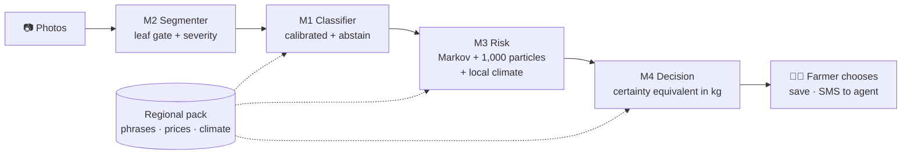

<div align="center">


# Jani

### Offline AI decision support for coffee farmers

**Photograph a leaf → measure the damage → project the loss → choose what to do.**
All on the phone. No internet. Photos never leave the device.

<br />

<a href="https://github.com/MiguelAlejandroB/jani/releases/download/v0.1.0/Jani.apk"></a>
&nbsp;
<a href="https://bloom-coffee-visions.lovable.app/"></a>
&nbsp;
<a href="#2-the-four-models"></a>

<br /><br />


<sub>Developed by <b>Miguel Alejandro Bermúdez</b> and <b>Juan Camilo Bermúdez</b> · <a href="https://berinpartners.com/"><b>Berin Partners</b></a> · Built for the <b>Small AI for Development</b> hackathon (World Bank × Hack-Nation) · Agriculture track</sub>

<br /><br />

<a href="https://berinpartners.com/"></a>
<a href="https://www.linkedin.com/company/berin-partners"></a>

</div>

---

## Project summary

**The problem.** Smallholder coffee farmers like *Noor* often notice a spot on a leaf with no agronomist nearby and no
mobile signal. Leaf rust and other diseases spread fast; by the time advice arrives, part of the harvest is gone — or
money is spent on a treatment that was not worth it.

**What we built.** **Jani**, an Android app that works **100 % offline** on the phones farmers already have. The farmer
photographs a few leaves; Jani checks each photo, measures how much of the leaf is damaged, names the likely disease (or
says *"I'm not sure"*), estimates how many **kilograms** of coffee could be lost by harvest using local climate, and
compares the options — do nothing, prune, fungicide, copper, biological — including hidden costs such as labour and
interest. The farmer chooses; high-risk cases can be sent to an extension agent by SMS (text only).

**Who benefits.** Smallholder coffee farmers with low connectivity and low digital literacy (voice on every screen,
icons, one action per screen), and the extension services and cooperatives that support them.

**What works today.** The full route photo → diagnosis → risk → decision → voice runs in **airplane mode** on a real
Android phone (APK above). Two vision models — 1.9 MB and 3.7 MB, INT8 — plus a Bayesian risk model and a risk-averse
decision model run entirely on the device; photos never leave it. Three regional packs (Spanish, English, Kiswahili)
change language, prices and climate **without touching code**, and the app is honest about uncertainty: it shows
ranges, flags demo data and abstains instead of guessing.



Jani is an Android app that turns a phone into an **offline plant-health advisor**. A farmer photographs coffee leaves;
Jani measures the damage, names the disease, projects the yield loss to harvest and compares what to do — **treat,
wait or consult a person** — in kilograms of coffee.

| | |
|---|---|
| 📲 **Download** | [Jani.apk (v0.1.0)](https://github.com/MiguelAlejandroB/jani/releases/download/v0.1.0/Jani.apk) — Android 8+ recommended (installs from Android 6), ~19 MB · also in this repo: [`download/Jani.apk`](download/Jani.apk) · [all releases](https://github.com/MiguelAlejandroB/jani/releases) |
| 🌐 **Landing page** | [bloom-coffee-visions.lovable.app](https://bloom-coffee-visions.lovable.app/) |
| ✈️ **Offline** | Internet only to download; then works in airplane mode |
| 📄 **One-pager** | [docs/ONE_PAGER.md](docs/ONE_PAGER.md) — the hackathon report in one page |
| 🔒 **Privacy** | Photos stay on the phone; SMS to an agent carries text only |

### Install in 4 steps
1. Open the **Download APK** button from your Android phone.
2. Open `Jani.apk` from Downloads; allow *Install unknown apps* for your browser if asked.
3. If Play Protect warns, tap **More details → Install anyway** (test build, not on Play Store yet).
4. Open Jani, pick your language pack, optionally set your hectares and use your location for local weather.

> Jani suggests; the farmer decides. It does not replace an extension agent.

---

## 1. What the farmer sees

```
Photos ─► Diagnosis ─► Weather question ─► Risk ─► Decision ─► Save / SMS to extension agent
```

1. **Photos** — 5 leaves (one per plant, walking the plot in zigzag); up to 30 to sharpen the estimate.
   Blurry, dark or leafless photos are rejected with a spoken reason.
2. **Diagnosis** — the dominant condition across the photos, or *"I'm not sure"* when confidence is low.
3. **One question** — did it rain heavily this week?
4. **Risk** — likely loss in **kg**, a P10–P90 range, the *bad-year* loss and the chance of a large loss, shown as a
   **ripening coffee cherry** (green / half-ripe / red; grey = consult).
5. **Decision** — option cards (do nothing, prune, systemic fungicide, copper, biological, miner control) with expected
   loss, cost, net gain vs. doing nothing, hidden costs (labour, interest, certification) and "N out of 10 times it
   beats doing nothing". Options that are not feasible today are greyed out with the reason.
6. **Save** — the case (never the photos) is stored on the phone; high-risk cases can be sent to an agent **by SMS,
   text only**.

Low-literacy design: large buttons, one action per screen, icons, and **automatic audio** on every screen (pack MP3s
if present, otherwise the phone's offline text-to-speech).

---

## 2. The four models

| # | Model | Type | Size on device | What it answers |
|---|---|---|---|---|
| M1 | Leaf classifier `arabica-v1` | MobileNetV3-Small, ONNX INT8 | 1.9 MB | Which condition? (healthy, rust, leaf miner, phoma, cercospora) |
| M2 | Leaf segmenter `leafseg-v1` | LR-ASPP MobileNetV3-Large, ONNX INT8 | 3.7 MB | Is there a leaf? How much of it is damaged? |
| M3 | Risk model `riesgo-v1` | Bayesian state-space model (Markov chain + particle filter) | params JSON | How many kg could I lose by harvest? |
| M4 | Decision model | Risk-averse expected-utility comparison | code + pack catalog | Which option is worth it for me? |

### M2 — Segmentation and severity
- Labels every pixel (256×256) as **background, leaf or symptom**.
- Severity `s = L / (H + L)` (symptom pixels over leaf + symptom), the same formula as the BRACOL expert masks.
- Also a **leaf gate**: rejects photos with too little leaf, non-green "leaf" pixels or noise-like texture.
- Test set (BRACOL, n = 50), deployed INT8: mIoU **0.885**, symptom IoU 0.73, severity MAE **0.62 points**,
  Pearson r **0.97**, severity level exact 86 % / within one level 100 %. Trained 60 epochs in Colab.

### M1 — Calibrated classification with abstention
- Input 224×224; outputs `softmax(z / T)` with a **temperature T** fitted on field photos, then an
  **abstention rule**: if the top probability or the margin is below threshold, Jani says *"I'm not sure"*.
- Trained 8 epochs on **JMuBEN (Kenya) + BRACOL (Brazil)**; temperature and thresholds calibrated on a held-out
  half of the Uganda and Peru field sets.
- **Honest generalisation numbers** on countries never used for training (deployed model):
  Peru **58 %**, Uganda **25 %**. The lab-to-field gap is large and documented in
  [docs/MODEL_RESULTS.md](docs/MODEL_RESULTS.md); it is why abstention and "consult" exist.

### M3 — Risk: from leaves to kilograms
1. **Adapter.** Each photo becomes an observation per disease: severity → damage level 0–3
   (< 1 %, 1–10 %, 10–30 %, > 30 %); without a segmenter, a sick leaf is a *censored* "level ≥ 1" observation.
2. **Measurement error.** A 4×4 matrix **Λ** (estimated with the real segmenter against expert masks) gives
   P(detected level | true level). Level 3 is locked (no >30 % leaves in BRACOL) and triggers "consult".
3. **Dynamics.** Disease advances through a **monotonic 4-state Markov chain** (0→1→2→3). Transition rates come
   from dwell times τ and are scaled by **standardised local climate anomalies** (max temperature, humidity, rain),
   from NASA POWER daily data 2001–2024 at **65 coffee locations**; the phone picks the nearest by GPS (≤ 150 km).
4. **Inference.** **1,000 particles** sample the plot's initial state π₀ from a Dirichlet regional prior; a tempered
   likelihood of the observed counts through Λ re-weights them; each particle is propagated to harvest.
5. **Loss.** Expected damage per state `g`, with **Beta** noise → loss fraction ℓ; yield `Y = Ŷ₀·(1 − ℓ)` with
   log-normal yield uncertainty and a conformal band. Output: P10 / P50 / P90 of loss, **CVaR₁₀** (mean loss in the
   worst 10 %), and P(loss > threshold), which drives the cherry colour.
6. **Flags** shown to the farmer: few leaves, low effective sample size, uncorrectable detector level, climate out of
   range, prior parameters.

### M4 — Decision: risk-averse, in kilograms of coffee
- Two epochs (now / in 3 weeks). Every action's net outcome X is converted to **kg-equivalents** (money ÷ price).
- Score = **certainty equivalent** with exponential utility:
  `CE = −(1/θ) · ln E[e^(−θX)]`, θ = r / median yield, r ∈ {3 cautious, 1 middle, 0.3 bold}.
- Costs include direct cost, **labour** (wage × days), **cost of money** (interest or own-cash opportunity cost),
  certification penalties and quality effects. Feasibility rules F0–F5 (deadline before harvest, certification,
  labour, liquidity).
- **Common random numbers** across actions, so differences are not simulation noise; **value of information** of
  re-measuring in 3 weeks; second-order stochastic dominance; "out of 10 times better than nothing".
- **Stopping rule.** While parameters are priors, Jani runs in **informative mode**: it shows ranges and trade-offs but
  does not single out one recommendation.

M3 and M4 are implemented twice — a Python reference (`training/riesgo_decision/jani_rd/`) and the app's TypeScript
(`app/src/engine/rd/`) — and **golden vectors** prove both give identical results (same seeded RNG: mulberry32 +
Box-Muller + Marsaglia-Tsang). The app runs them in a **Web Worker** (~1.2 s on a laptop).

---

## 3. How each model was trained and quantized (in depth)

Both vision models are trained in **Google Colab (GPU T4)** with the notebooks in `training/`, which download the data,
train several candidate architectures, calibrate, export to ONNX, quantize, re-evaluate the quantized file **with the
same arithmetic as the phone**, and write a `model_card.json` that the app reads (classes, normalisation, temperature,
thresholds, metrics). The app never hard-codes any of these values. Values below are the notebook settings and the
**deployed** model cards in `app/public/models/`.

### 3.1 M1 — leaf classifier (`training/jani_train.ipynb` → `app/public/models/arabica-v1/`)

**Purpose.** Name the leaf condition so the risk model knows which disease chain to update — and refuse to answer
when the photo is out of its competence.

| Item | Setting |
|---|---|
| Classes | `sana` (healthy), `roya` (rust), `minador` (leaf miner), `phoma`, `cercospora` |
| Candidates | `efficientnet_lite0` and `mobilenetv3_small_100` (timm, ImageNet-pretrained, new 5-class head) |
| Deployed | **mobilenetv3_small_100** — chosen because it scored best on the field hold-out (0.513 vs 0.383) and is smallest |
| Training data (deployed card) | JMuBEN/JMuBEN2, Kenya: **27,625 images** (capped at 6,500 per class); BRACOL, Brazil: **1,343 leaves** |
| Field data | Uganda (Soroti Univ.) and Peru (Saposoa), split **by leaf** so copies of one leaf never cross splits. Notebook option: Uganda 40 % train / 20 % calibration / 40 % test; Peru 50 % calibration / 50 % test (Peru never trained on). `FIELD_SHARE = 0.25`: 1 in 4 training photos per epoch is a field photo (weighted sampler) |
| Data cleaning | Exact/near duplicates removed with a 64-px high-pass texture descriptor over 8 rotations/flips, cosine ≥ **0.80** = same leaf (copies ≥ 0.94, different leaves ≤ 0.49); truncated images rejected by full decode |
| Input | 224×224, stretched (no crop), RGB, ÷255, ImageNet mean/std |
| Augmentation | RandomResizedCrop(scale 0.5–1, ratio 0.6–1.67), horizontal + vertical flips, rotation ±25°, ColorJitter(0.35, 0.35, 0.3, 0.05) |
| Optimisation | AdamW (lr 1e-3, weight decay 1e-4), **OneCycle** schedule, cross-entropy with **label smoothing 0.1**, mixed precision (AMP), batch 64, **8 epochs**, seed 42 |
| Checkpoint selection | Epoch with the best accuracy on the **field calibration** split (not on the in-distribution validation, which saturates at 100 %) |
| Confidence calibration | **Temperature scaling** fitted with L-BFGS on the field calibration logits, each country weighted equally → deployed **T = 0.127** |
| "I'm not sure" rule | Abstain if `max p < min_confidence` **or** `p₁ − p₂ < 0.15`. `min_confidence` = lowest value on a 0.40–0.95 grid reaching mean precision ≥ **0.90** with coverage ≥ **0.30** on the calibration half → deployed **0.50** |

**Export and quantization.**
1. `torch.onnx.export`, **opset 17**, input `input` [1,3,224,224] NCHW → output `logits`; `onnx.checker` validation.
2. `quant_pre_process` (shape inference + graph clean-up).
3. **Static post-training quantization** `quantize_static`: **QDQ format**, **per-channel** weights, weights **QInt8**,
   activations **QUInt8**. Calibration reader: **300 images** (≈ 2/3 JMuBEN training photos + 1/3 field photos), so the
   activation ranges cover field lighting.
4. **Stability gate:** INT8 is used only if its accuracy differs from FP32 by ≤ **0.02** and its predictions disagree
   with FP32 on ≤ **5 %** of photos, and the file is ≤ 10 MB (challenge limit); otherwise FP32 ships.
5. Evaluation runs with `ORT_DISABLE_ALL` (no graph optimisation) because desktop onnxruntime fuses INT8 kernels
   differently; unoptimised CPU matches onnxruntime-web on the phone within **< 0.5 logits**.

**Size:** FP32 6.10 MB → **INT8 1.86 MB**. **Latency:** ~15 ms/photo on Colab CPU (unoptimised).

**Results (deployed card).** In-distribution validation (JMuBEN, n = 4,875): 100 % — not informative. Field hold-out,
photos never used for training or calibration: **Uganda 24.7 %** (n = 1,500), **Peru 58.0 %** (n = 200); the INT8 file on
the combined field hold-out: 51.3 % accuracy at 95 % coverage. On Peru's unknown class (*ojo de gallo*) it abstains only
3 % of the time. Full analysis and the planned fixes are in [docs/MODEL_RESULTS.md](docs/MODEL_RESULTS.md).
*Caveat:* the card reports a higher score for INT8 than for FP32 on the field hold-out (51.3 % vs 28.7 %); this
inconsistency between evaluation passes is not yet explained and should be re-checked before quoting INT8 figures.

### 3.2 M2 — leaf segmenter (`training/jani_segmentation.ipynb` → `app/public/models/leafseg-v1/`)

**Purpose.** Measure **how much** of the leaf is damaged (the classifier only says *what*), and reject photos that do
not contain a leaf before anything else runs.

| Item | Setting |
|---|---|
| Classes (output channel order) | `fondo` (background), `hoja` (leaf), `sintoma` (symptom) |
| Candidates | LR-ASPP head on **MobileNetV3-Small** and **MobileNetV3-Large** (torchvision, ImageNet weights, dilated backbone) |
| Deployed | **LR-ASPP MobileNetV3-Large**, best symptom IoU on validation (0.726 vs 0.706) |
| Data | BRACOL segmentation set (Esgario et al., [lara2018](https://github.com/esgario/lara2018), MIT): **400 train / 50 val / 50 test** leaves with expert masks (black = background, green = leaf, red = symptom) |
| Input | 256×256 stretched, RGB, ÷255, ImageNet mean/std; images cached at 320 px for random crops |
| Augmentation | Random crop → resize 256 (bilinear image, nearest mask), rotations/flips, colour jitter |
| Loss | Cross-entropy with **class weights** `(N / (3·nₖ))^0.5` (symptom pixels are rare) **+ Dice loss** on the symptom class |
| Optimisation | AdamW (lr 1e-3, wd 1e-4), OneCycle, batch 16, **60 epochs**, seed 42; validated every 5 epochs; best symptom IoU kept |
| Severity | `s = symptom / (leaf + symptom)`; display levels from BRACOL (healthy < 0.1 %, very low < 5 %, low < 10 %, high < 15 %, very high). The risk model uses its own levels (< 1 %, 1–10 %, 10–30 %, > 30 %) |
| Leaf gate | Leaf + symptom ≥ **10 %** of the image, ≥ **64 %** of "leaf" pixels greenish (G > R and G > B), and grayscale Laplacian variance ≤ **2,500**. Thresholds set on 300 JMuBEN leaves vs 300 Food-101 non-leaf images, then re-checked on 140 field photos (Uganda/Peru) |

**Export and quantization.** Same pipeline as M1: ONNX opset 17 (`input` → `logits` [1,3,256,256], per-pixel argmax),
`quant_pre_process`, `quantize_static` with **QDQ, per-channel, QInt8 weights / QUInt8 activations**, calibration with
**100 training images**. Stability gate: mIoU drop ≤ **0.02** and pixel disagreement with FP32 ≤ **3 %**. The small
backbone failed the gate (shipped FP32 there); the large one passed.

**Size:** FP32 12.87 MB → **INT8 3.72 MB**. **Latency:** ~62 ms/photo on CPU (unoptimised).

**Results (test, n = 50)**

| | FP32 | **INT8 (deployed)** |
|---|---|---|
| IoU background / leaf / symptom | 0.989 / 0.968 / 0.743 | 0.980 / 0.950 / **0.726** |
| mIoU | 0.900 | **0.885** |
| Severity MAE (points) | 0.52 | **0.62** |
| Severity Pearson r | 0.983 | **0.968** |
| Severity level exact / within one | 88 % / 100 % | **86 % / 100 %** |

Limits: trained on 400 Brazilian leaves on a light background — severity on cluttered field backgrounds is less precise.

### 3.3 M3/M4 — risk and decision calibration (`training/riesgo_decision/`, run locally)

No neural network: these are probabilistic models whose parameters are **calibrated locally** and shipped as
`app/public/models/riesgo-v1/params.json` (version `2026-10-04-v1`).

| Parameter | How it was set | Status |
|---|---|---|
| Λ (4×4 detection matrix) | Real segmenter vs BRACOL expert masks (val + test, 100 leaves) | **Estimated**; level 3 locked |
| Climate normals | NASA POWER daily 2001–2024, 65 sites → weekly standardised anomalies (`build_climate.py`) | Data |
| Rust dynamics τ, γ_w | Block-coordinate fit on CATIE/Mendeley panel (442 obs.) | **Not identifiable** (A4 violated) → prior kept |
| Treatment efficacy order | USDA ARS Hawaii 2022–23 trials (logit slope of incidence) | Consistent with priors (systemic > copper > biological) |
| Damage g, κ, Ŷ₀, θ, regional π₀ | Expert-criteria priors, 200 parameter draws per disease | **Prior** |

Verification: synthetic recovery tests (Λ error < 0.05, conformal coverage 80 % ± 3 %), 31 property tests, 8/8
deliberate mutations caught, and Python ↔ TypeScript golden vectors.

---

## 4. Edge AI: how it runs on the phone

- M1 and M2 are exported to **ONNX** and **INT8-quantised** (~4× smaller than FP32), executed with
  **onnxruntime-web (WebAssembly)**. The `.wasm` files ship inside the app (`app/public/ort/`), never from a CDN.
  Browser-vs-Python output difference was verified < 0.5.
- Photos are downscaled with anti-aliasing (stepwise halving), matching the PIL bilinear resize used in training.
- The web app is a **PWA** (Vite + Workbox precache) wrapped as an Android APK with **Capacitor**.
- All farmer-facing text, prices, yields, calendars, action catalogues and climate normals come from a **regional
  pack** (`packs/<id>/pack.json`); no agronomic or economic number is hard-coded. Every value goes through
  `engine/resolve.ts`: real sourced value → else demo value (the screen shows a **"demo data"** badge) → else *consult*.

---

## 5. Regional packs

| Pack | Language | Region | Climate points |
|---|---|---|---|
| `colombia-andina` | Spanish | Colombian coffee belt | 32 |
| `noor-africa-oriental` | Kiswahili | Kenya, Uganda, Tanzania, Rwanda, Burundi, Ethiopia | 27 |
| `english-demo` | English | Demo for all regions | 65 (incl. Hawaii, Puerto Rico, Brazil, Guatemala, Costa Rica) |

A pack is a zip (`pack.json` + optional `audio/*.mp3`) installable from the catalogue or a file. Teams fill real
prices, yields and calendars **without touching code**. Packs currently carry `demo_values`; real values are `null`
with `source: "TODO"` until a local partner signs them off.

---

## 6. Repository layout

```
app/                     React 19 + Vite + TypeScript (strict) PWA, Capacitor Android project
  src/engine/            see, segment, quality, session, predict, decide, resolve, voice, sms
  src/engine/rd/         risk & decision models (adapter, markov, risk, decision, catalog, location, worker)
  src/screens/           one file per screen
  public/models/         arabica-v1 (M1), leafseg-v1 (M2), riesgo-v1 (M3 params) with model cards
  public/ort/            onnxruntime-web WASM
  e2e/                   Playwright end-to-end tests
  android/               Capacitor Android project
packs/                   regional packs (pack.json, audio/)
training/
  jani_train.ipynb       M1 training notebook (Colab)
  jani_segmentation.ipynb M2 training notebook (Colab)
  riesgo_decision/       M3/M4 Python reference, calibration, climate builder, tests
  make_audio.py          optional MMS-TTS audio generation per pack
scripts/                 pack builder
docs/                    detailed documentation (English); docs/es/ = Spanish originals
```

---

## 7. Build and run

Requirements: Node 20+, npm. For the APK: JDK 21 and Android SDK 35.

```bash
cd app
npm install                 # also copies the onnxruntime-web WASM into public/ort
npm run dev                 # local dev server
npm run build               # typecheck + production PWA in app/dist (builds packs first)
npm run preview             # serve the build
npm run verify              # typecheck + lint + unit tests + build + e2e

# Android APK (debug)
npm run android:sync        # build + capacitor sync
cd android && ./gradlew assembleDebug   # → android/app/build/outputs/apk/debug/app-debug.apk
```

Tests: **169 Vitest unit tests** (engine, packs, risk/decision golden vectors, location, field fixtures) and
**Playwright e2e** (full route in simulated and real-model modes, airplane mode, packs, GPS climate, screenshots).
Python: `training/riesgo_decision/tests` (31 property tests + 6 synthetic-recovery tests).

Recalibrate M3/M4 locally:

```bash
cd training/riesgo_decision
python -m pytest tests -q
python run_calibration.py --rust data/CLRI_14D.csv --usda data/usda_fungicides_clr.csv --lambda_json data/lambda.json
python build_climate.py     # NASA POWER climate normals for every coffee location
```

---

### Dependencies and environment files

| Part | Environment | Dependencies file |
|---|---|---|
| App (PWA + Android) | Node 20+, npm | [`app/package.json`](app/package.json) / `package-lock.json` |
| Android APK | JDK 21, Android SDK 35 (build-tools 35), Gradle wrapper 8.11 | [`app/android/`](app/android/) |
| Risk & decision (Python reference, calibration, tests) | Python 3.11+ | [`training/riesgo_decision/requirements.txt`](training/riesgo_decision/requirements.txt) |
| Vision training (Colab GPU) | Google Colab | [`training/requirements-colab.txt`](training/requirements-colab.txt) (installed by each notebook) |

Runtime app dependencies: `onnxruntime-web` (on-device inference, WASM), `react` / `react-dom` (UI), `idb-keyval`
(IndexedDB storage), `fflate` (pack zips), `@capacitor/core` + `@capacitor-community/text-to-speech` (Android shell and
offline voice). Dev: Vite + `vite-plugin-pwa` (Workbox precache), TypeScript 6, Vitest, Playwright, ESLint.
No API keys or `.env` files are needed: nothing calls a server.

### Dataset

**N/A — no new dataset was generated.** Jani uses the public datasets in section 8. Small derived artefacts needed to
reproduce the risk model are versioned in [`training/riesgo_decision/data/`](training/riesgo_decision/data/):
weekly climate normals per coffee site (`clima_puntos.json`, `clima_semanal.json`), the detection matrix Λ
(`lambda.json`), the rust panel and fungicide trials used for calibration (`CLRI_14D.csv`, `usda_fungicides_clr.csv`)
and the calibration report.

---

## 8. Data and licences

| Dataset | Country | Size | Licence | Use |
|---|---|---|---|---|
| [JMuBEN + JMuBEN2](https://huggingface.co/datasets/Project-AgML/arabica_coffee_leaf_disease_classification) | Kenya | 58,549 images | CC BY 4.0 | M1 training |
| [BRACOL](https://data.mendeley.com/datasets/yy2k5y8mxg/1) | Brazil | 1,747 leaves + masks | CC BY 4.0 | M1 training, M2 training, Λ estimation |
| [Uganda (Soroti University)](https://data.mendeley.com/datasets/k36wnd6knb/1) | Uganda | 3,312 images | CC BY 4.0 | M1 calibration / held-out test |
| [Peru (Saposoa)](https://data.mendeley.com/datasets/mfpxg4y65r/1) | Peru | 1,500 images | CC BY 4.0 | M1 held-out test |
| CATIE / Mendeley rust panel (Lasso et al. 2020) | — | 442 obs. | CC BY 4.0 | M3 dynamics attempt |
| USDA ARS Hawaii fungicide trials 2022–23 | USA | — | CC0 | Ordering of treatment efficacy |
| NASA POWER daily (AG community) | 65 sites | 2001–2024 | Public | Climate normals |

Fonts: Fraunces (SIL OFL). Optional Swahili audio: Meta MMS-TTS (non-commercial licence; see docs/DATA.md).

---

## 9. Honest limitations

- **Field generalisation of M1** is weak (Peru 58 %, Uganda 25 %); abstention and "consult" mitigate it.
- **Risk parameters are expert priors.** The public rust panel violated the monotonic-chain assumption (leaf renewal
  dilutes incidence), so dynamics could not be identified; Jani therefore stays in informative mode and shows a
  "technical-criteria estimate" flag. Real harvests per plot, captured by the follow-up feature, are needed.
- **Prices, yields and costs are demo values** until local partners provide sourced numbers.
- The APK is a **debug build** (not on Play Store).

---

### If we had more time
- Re-train M1 with more field photos per country and re-check the INT8-vs-FP32 gap on the field hold-out.
- Replace demo prices, yields and expert priors with sourced values from local partners; record real harvests per
  plot with the follow-up feature to calibrate the disease dynamics.
- Native-speaker review and recorded audio for Kiswahili; signed release build on Play Store.

---

## 10. Documentation

| Document | Content |
|---|---|
| [docs/ONE_PAGER.md](docs/ONE_PAGER.md) | **One-page report** for the jury: challenge, models, results, challenges, timeline |
| [docs/RISK_DECISION_MODELS.md](docs/RISK_DECISION_MODELS.md) | Risk & decision implementation, calibration, verification |
| [docs/RISK_DECISION_MODELS_MANUAL.md](docs/RISK_DECISION_MODELS_MANUAL.md) | Full mathematical specification of M3/M4 |
| [docs/MODEL_RESULTS.md](docs/MODEL_RESULTS.md) | M1 training runs and field results |
| [docs/DATA.md](docs/DATA.md) | Datasets, licences, sizes, gaps |
| [docs/DECISIONS.md](docs/DECISIONS.md) | Design decisions log |
| [docs/QA_REPORT.md](docs/QA_REPORT.md) | QA and acceptance criteria |
| [docs/HUMAN_TODO.md](docs/HUMAN_TODO.md) | What the team must still provide (real values, audio, validation) |
| [JANI_PLAN.md](JANI_PLAN.md) | Original product specification (historical) |
| [docs/es/](docs/es/) | Spanish originals |

---

## 11. Credits

<div align="center">

**Jani is designed and developed by [Berin Partners](https://berinpartners.com/).**

**Team:** Miguel Alejandro Bermúdez · Juan Camilo Bermúdez

[🌐 berinpartners.com](https://berinpartners.com/) · [💼 LinkedIn](https://www.linkedin.com/company/berin-partners) · [☕ Jani landing page](https://bloom-coffee-visions.lovable.app/) · [📲 Download the APK](https://github.com/MiguelAlejandroB/jani/releases/download/v0.1.0/Jani.apk)

<sub>Datasets © their authors under the licences listed in section 8.</sub>

</div>
