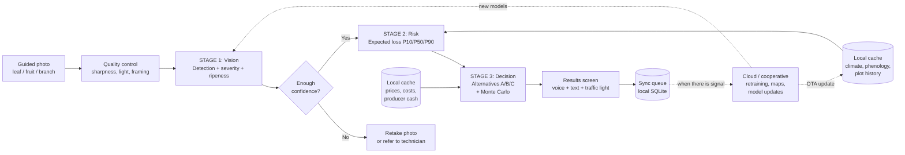

> Historical planning document. `README.md` describes the current state of the project.

# Comprehensive plan: "Pocket Agronomist" (Proposal 1)

**Offline app for coffee farmers: photo → detection → loss risk → alternatives with hidden costs**
Prepared by the Elite Advisory Council, Innovation and Strategic Development · October 2026

> **Note on rigor.** The references at the end were verified through searches during this conversation. The numeric targets (KPIs, thresholds) are **proposals to be validated with our own data**, not published results. Several sources are preprints or third-party technical documents; use them as leads, not as proof of performance.

---

## 1. Executive summary

| Question | Answer |
|---|---|
| **What it is** | An Android-first app that works 100% without internet. The coffee farmer takes a photo; the phone detects the disease or pest and its severity, estimates the expected loss, and compares alternatives (A, B, C) with their direct cost and hidden costs. |
| **Architecture** | Three models in cascade: (1) a vision neural network, (2) a loss-risk ML model, (3) ML + simulation for the financial forecast of each alternative. |
| **What is pretrained and what is not** | Vision builds on public models and datasets, but **requires fine-tuning with photos of Colombian coffee**. The risk and decision models **do not exist pretrained**: they are the project's own asset. |
| **Real bottleneck** | It is not the model. It is the **real loss labels per plot** (how much was actually harvested) paired with the photos. |
| **Who pays** | The coffee farmer does not pay. Cooperatives, exporters, insurers, banks and buyers with sustainability goals pay (see section 12). |

---

## 2. Design principles

1. **Truly offline-first.** Everything needed for the decision (models, recent climate, price table, local costs) lives on the phone. Connectivity only syncs and updates.
2. **Visible uncertainty.** Never a single number: always ranges (P10/P50/P90) and a confidence level.
3. **The language model does not diagnose.** It only verbalizes what models 1 to 3 produce (in v1 it is not even needed: templates are used).
4. **The producer edits the assumptions.** Day-labor wage, interest rate, expected price: they are editable.
5. **Decision support, not a substitute for the technician.** If confidence is low, the app refers to a human.
6. **It learns with every photo.** Every diagnosis is recorded (with consent) for retraining.

---

## 3. General architecture



### Technical layers

| Layer | Options | Recommendation |
|---|---|---|
| **Mobile client** | Native Kotlin, Flutter, React Native | **Android-first** (assumption to validate with the cooperatives). Flutter or Kotlin with TFLite/ONNX Runtime Mobile. |
| **On-device inference** | TensorFlow Lite, ONNX Runtime Mobile, ExecuTorch | **TFLite or ONNX** for vision and XGBoost/LightGBM; engines such as llama.cpp/Cactus for the language model (phase 2). |
| **Local storage** | SQLite | Compressed photos, results, sync queue, climate and price cache. |
| **Backend** | Any cloud | Sync API, photo storage, training pipeline (MLOps), dashboard for cooperatives. |
| **MLOps** | MLflow / DVC / equivalents | Versioning of data and models; deployment in "shadow mode" before activating a new model. |

---

## 4. End-to-end workflow (what happens on every tap)

### Step 0. Plot profile (once, and kept up to date)
Variety, age, altitude, area, shade, date of last pruning and fertilization, **phenological stage**, history of problems, and whether the year is a **high or low load** year (biennial bearing influences disease severity).

### Step 1. Guided capture
- Screen with a visual guide (leaf/fruit/branch silhouette), light and sharpness indicator.
- **Sampling protocol:** n photos per plot at defined points (e.g. 5 plants in a zigzag) so as not to depend on a single photo.
- Automatic quality control: if blurry or too dark, it asks to retake.

### Step 2. Stage 1, Vision (neural network)
Outputs per photo:
- **Class**: rust, leaf miner, phoma, cercospora, coffee berry borer, nutritional deficiency, healthy, etc.
- **Severity**: % of leaf area affected (lesion/leaf pixel ratio) or % of fruit with damage.
- **Fruit ripeness** and **cherry count** (when applicable).
- **Calibrated confidence.**

### Step 3. Stage 2, Loss risk (tabular ML)
- Inputs: Stage 1 outputs aggregated per plot, phenology, altitude, age, climate of the last 30 days and the forecast available in the cache, history, high/low load, cherry count.
- Outputs: **expected production loss (P10 / P50 / P90)** and **probability of exceeding a critical threshold in 30 to 60 days**.

### Step 4. Stage 3, Financial decision
- Generates the applicable alternatives (e.g. A: do not intervene; B: selective pruning; C: pruning + fungicide; D: renew the plot).
- For each one it estimates the effect on the loss and computes the **expected net margin, worst case (CVaR) and hidden costs** (section 8).

### Step 5. Presentation
- Risk traffic light, loss range, ranking of alternatives, **"what happens if I wait 3 weeks"**, and a spoken explanation.
- **"Edit my assumptions"** button (day-labor wage, rate, price).

### Step 6. Logging and sync
Everything is saved locally; when a signal is detected it syncs. **Follow-up:** 4 to 8 weeks later the app asks *"what did you do and what happened?"*. That data is the label that feeds Stages 2 and 3.

---

## 5. Best combinations to make it real

Three combinations of components, from fastest to most ambitious. **Recommendation: start with a trimmed Combination 2** (section 5.2), not with 1 or 3.

### 5.1 Combination 1: "Minimum viable" (8 to 12 weeks)

| Stage | Component |
|---|---|
| Interface | Text templates + icons + prerecorded audio (no language model) |
| 1. Vision | Fine-tuned **multiclass YOLO-nano** (rust, berry borer, ripeness) + severity via lightweight segmentation |
| 2. Risk | **LightGBM/XGBoost** with quantile regression |
| 3. Decision | **Rules + Monte Carlo** (no ML in the effect of actions; effects taken from extension tables) |

**Use it if:** you need a demo for partnerships and funding.
**Limit:** the effect of each action is a fixed table, not learned.

### 5.2 Combination 2: "Recommended" (5 to 7 months)

| Stage | Component | Why |
|---|---|---|
| Interface | Templates + **voice** (Whisper tiny/base) and, in phase 2, a **small language model** (Gemma 4 E2B/E4B or Qwen 3.5 2B) | Literacy barrier; the model only writes up what the models say. |
| 1. Vision | **Fine-tuned YOLO** (leaf, berry borer, ripeness) + **two-stage segmentation** (leaf → lesion) for severity; SAM only to isolate the leaf | Severity is the variable Stage 2 needs most. |
| 2. Risk | **Quantile LightGBM** + **TabPFN as a baseline** + conformal calibration | Few labeled data: the baseline avoids false confidence. |
| 3. Decision | **Effect-per-action model** (boosting per scenario) + **Monte Carlo** + **prices**: Chronos/TimesFM/TTM in the cloud, quantile table pushed to the phone | Combines learning and simulation with probabilistic price. |

### 5.3 Combination 3: "Scale" (12+ months, with accumulated data)

Everything above plus: **federated learning** (photo data does not leave the phone), **causal models** of effect per action (when there is enough history of what was done and what happened), **spatial risk** between neighboring farms and **linkage with parametric insurance and credit**. This is the council's Proposal 2, reached by evolving from this one.

### 5.4 Decision matrix per stage

| Stage | Best option today | Alternative | Avoid |
|---|---|---|---|
| Detection | YOLO fine-tuned on coffee | MobileNet/EfficientNet-Lite classifier (simpler, less accurate on dense fruit) | Generic PlantVillage models without fine-tuning |
| Severity | Two stages (leaf → lesion), pixel ratio | Direct severity regression from the image | SAM directly on lesions without fine-tuning |
| Risk | Calibrated quantile LightGBM | TabPFN; survival models (phase 3) | A single loss figure without a range |
| Price | Foundation-model quantiles **compared with a simple model** | ARIMA/smoothing only | Trusting zero-shot without backtesting |
| Decision | Monte Carlo over effect + costs | Optimization with cash constraints | Recommending without showing assumptions |
| Language | Templates in v1; small LM in v2 | Voice with prerecorded answers | An LM that generates free-form diagnoses |

---

## 6. Catalog of pretrained components and what to do with each

**Status:** *Ready* = plug in; *Fine-tune* = requires fine-tuning with local data; *Build* = does not exist, to be developed.

### Stage 0: Interface
| Component | Use | Status |
|---|---|---|
| Gemma 4 E2B/E4B | Plain-language explanation; audio input; ~5 GB of RAM reported with 4-bit quantization and Apache 2.0 license (verify in the official source) | Ready (phase 2) |
| Qwen 3 / 3.5 (0.6B to 9B) | Alternative for modest phones; broad language support | Ready (phase 2) |
| Whisper tiny/base | On-device speech to text | Ready |

### Stage 1: Vision
| Component | Use | Status |
|---|---|---|
| Datasets BRACOL, RoCoLe, JMuBEN/JMuBEN2, DPCL | Fuel for fine-tuning (verify each license; RoCoLe has a copy on Hugging Face with a declared MIT license) | Data |
| YOLOv8/YOLO11 on coffee leaf | Rust, leaf miner, phoma, cercospora | Fine-tune |
| YOLO for berry borer (YOLOv26n variant) | Berry borer damage on dense fruit (originally deployed on a Raspberry Pi 5; it has to be adapted to the phone) | Fine-tune |
| ASD-YOLO / ODANet / YOLO11 on ripeness | Ripeness in 4 states | Fine-tune |
| YOLOv8 for cherry counting with a smartphone | Estimation of plot load | Fine-tune |
| Two-stage segmentation (StripeRust-Pocket pattern) | Severity as lesion/leaf ratio, offline on mobile | Fine-tune |
| SAM / LIME | Isolate the leaf (zero-shot); lesion requires fine-tuning | Fine-tune |

### Stage 2: Risk
| Component | Use | Status |
|---|---|---|
| Rust ML recipes with NASA-POWER data (RF, XGBoost, MLP, SVM) | Feature design and validation | Build |
| Cenicafé Agroclimatic Platform | Source of local historical climate | Data |
| TabPFN | Baseline with few data | Try |

### Stage 3: Decision
| Component | Use | Status |
|---|---|---|
| Chronos / Chronos-2 / TimesFM 2.5 / Moirai-2 / Time-MoE | Probabilistic price forecast (in the cloud, weekly) | Ready, with backtesting |
| TTM | Compact candidate to run on the phone | Try |
| FedChronos | Federated price tuning (phase 3) | Future |
| Effect per action, hidden costs, Monte Carlo | Decision core | **Build** |

> **Warning about time series.** In an independent benchmark of extreme events, no foundation model outperformed trained recurrent models, and one showed instability in extreme errors; in finance, a good generic ranking did not guarantee useful forecasts. Always compare them with a simple model.

---

## 7. Model specification

### 7.1 Stage 1: Vision

| Aspect | Proposed specification |
|---|---|
| **Tasks** | Multiclass detection + lesion segmentation + ripeness/counting (separate, lightweight models) |
| **Format** | TFLite or ONNX, INT8 quantized; target of 5 to 15 MB per model (to be validated) |
| **Training data** | Public datasets + our own photos of Colombian coffee (Castillo, Caturra, Colombia, etc.) in real field light and low-end phones |
| **Data augmentation** | Variation of light, shadow, humidity, background, angle, blur |
| **Metrics** | Per class: precision, recall, mAP; for severity: mean absolute error and correlation with expert assessment |
| **Priority** | **High recall on high-severity diseases** (a false negative costs more than a false positive) |
| **Proposed target** | Recall ≥ 0.90 on severe rust and berry borer in **field** validation (not just laboratory); ECE ≤ 0.05 |

### 7.2 Stage 2: Loss risk

| Aspect | Proposed specification |
|---|---|
| **Model** | Gradient boosting with quantile regression (P10/P50/P90) + critical-threshold classifier |
| **Features** | Severity and class aggregated per plot, fraction of affected plants, phenology, altitude, age, shade, 30-day climate (maximum temperature, days with high humidity, rain), cherry count, high/low load, history |
| **Label** | Actual production of the plot at the following harvest (kg/ha) vs. expected without the problem |
| **Validation** | By **plot** and by **year** (never mix photos of the same plot between training and test) |
| **Calibration** | Conformal prediction or isotonic calibration |
| **Baseline** | Simple model (regression) + TabPFN; the boosting must beat them |

### 7.3 Stage 3: Decision

| Component | Specification |
|---|---|
| **Effect per action** | A model (or initial rule) that estimates the loss reduction per alternative given the severity, stage and conditions. It starts as an **extension table validated by Cenicafé/technicians**; it evolves into a learned model with the follow-up data |
| **Price** | Weekly quantiles (cloud) with an age stamp: *"price estimated X days ago"* |
| **Simulation** | Monte Carlo (e.g. thousands of scenarios) over loss, price and costs |
| **Output** | Expected net margin, CVaR 10%, probability of negative margin, itemized hidden costs |

---

## 8. Decision engine: direct and hidden costs

For each alternative *i*:

```
Margin_i = E[Income_i] − Direct_cost_i − Hidden_costs_i

E[Income_i] = (Base production − Loss_i) × Expected price × Quality factor_i
```

### Hidden costs that the model must always quantify

| Hidden cost | How it is estimated |
|---|---|
| **Cost of money** | producer's rate × amount × time to harvest (if borrowing is required) |
| **Opportunity cost of labor** | local day-labor wage in harvest season vs. the value of that day's labor in another task |
| **Cost of waiting** | difference in expected loss between acting today and acting in 2 to 4 weeks |
| **Certification / residue risk** | loss of premium if the input is not compatible with the producer's certification |
| **Effect on quality** | change in cup score or yield factor |
| **Externality to neighbors** | risk of contagion to nearby plots if no action is taken (phase 2: spatial model) |
| **Resistance / repeated use of agrochemicals** | penalty for repeated applications |
| **Liquidity** | if there is no cash today, alternative C may be unviable even if it is the best in margin |

### Example output (**hypothetical** figures, illustrative only)

| Alternative | Direct cost | Main hidden costs | Loss P50 / P90 | Expected margin |
|---|---|---|---|---|
| A. Do not intervene | $0 | Contagion, lower quality | 22% / 41% | Low, high risk tail |
| B. Selective pruning | Day-labor | Lower leaf density | 11% / 19% | Medium |
| C. Pruning + fungicide | Input + application | Cost of money, labor at harvest, certification | 6% / 12% | High, requires cash today |

---

## 9. Minimum data schema

### 9.1 Entities

| Entity | Key fields |
|---|---|
| **Producer** | anonymous id, consent, cooperative, language, preferred channel |
| **Plot** | id, GPS (polygon or point), area, variety, age, altitude, shade, history |
| **Sampling** | id, plot, date, protocol, sampling points |
| **Photo** | id, sampling, type (leaf/fruit/branch), GPS, date, quality, device |
| **Vision result** | photo, class, severity, confidence, model version |
| **Risk** | sampling, P10/P50/P90, threshold probability, model version |
| **Recommendation** | sampling, alternatives, margins, hidden costs, assumptions used |
| **Action taken** | plot, date, chosen alternative, actual cost |
| **Outcome** | plot, actual harvest (kg), quality, follow-up date |

### 9.2 Data that must be captured no matter what in order to train
- **Actual harvest per plot** (kg and date).
- **What the producer did** and when.
- **Actual cost** of what was done.
- **Photos with GPS and date**, to pair them with the outcome.

> Without these four fields, Stages 2 and 3 remain weak even if the vision is excellent.

---

## 10. Data and labeling plan

1. **Partnership with 2 to 3 cooperatives** (or committees) willing to record harvest per plot.
2. **Standard photo protocol**, with brief training of technicians and promoters.
3. **Labeling by experts** (agronomists/extension agents): class, severity and cross-checking between two reviewers on a sample.
4. **Frozen field validation set**: photos of plots that never enter training.
5. **Improvement cycle**: the errors detected by technicians go back into training.
6. **Data size:** decide with *learning curves* (train with 25%, 50%, 100% and see whether performance keeps improving), not with a fixed figure.

---

## 11. Roadmap (proposal)

| Phase | Duration | Deliverables | Pass criterion (gate) |
|---|---|---|---|
| **0. Partnerships and framework** | Weeks 1 to 4 | Agreements with cooperatives and extension; data protocol; consent; legal review; loss baseline | Cooperative(s) signed and access to harvest records |
| **1. Data and vision prototype** | Weeks 5 to 14 | First labeled photos; vision models v0; alpha capture app | Minimum recall and calibration in field validation |
| **2. Risk and decision v1** | Weeks 12 to 24 | Risk model; decision engine with validated tables; complete offline beta app | Risk model beats the baseline; technicians validate the recommendations |
| **3. Controlled pilot** | Months 6 to 12 | Staggered deployment per cooperative; tracking of actions and outcomes; retraining | Evidence of effect (lower loss, better margin) |
| **4. Scale and financing** | Month 12 onward | Federated learning, spatial risk, linkage with insurance/credit | Business cases with confirmed payers |

### Pilot design (for causal evidence)
- **Staggered deployment** (stepped-wedge) or groups with and without the app per cooperative.
- **Indicators:** pest loss, yield, net income per ha, agrochemical use, time to act, adoption and retention.
- **Ethical care:** no one is left without service at the end of the pilot.

---

## 12. Business model and shared value

| Actor | Contributes | Receives |
|---|---|---|
| **Coffee farmer** | Photos, plot data, follow-up | Free diagnosis and decision; fewer losses; better margin |
| **Cooperative / exporter** | Access to producers, harvest records, trusted channel | Georeferenced phytosanitary surveillance; more predictable quality and volume |
| **Insurer / bank** | Financing, products | Verifiable risk data; lower claims and delinquency |
| **Buyer / brand** | Premiums, commitments | Traceability and evidence of sustainability |
| **Funder / IDB / green funds** | Seed capital | Causal evidence of impact |
| **Extension (FNC/Cenicafé)** | Technical knowledge, validation | Reach and field data |

**Verifiable shared-value indicators:** reduction in loss per hectare, increase in net income, avoided delinquency, avoided claims, sustained adoption.

---

## 13. Risks and mitigations

| Risk | Impact | Mitigation |
|---|---|---|
| **Lab-field gap** in vision | False negatives that cost harvest | Frozen field validation; recall as priority; multi-photo sampling; referral to a technician |
| **Scarce loss labels** | Weak Stage 2 | Harvest-recording partnerships from phase 0; simple baselines |
| **Outdated offline data** | Biased recommendations | Mark the age of the data; widen uncertainty bands |
| **Model overconfidence** | Wrong decisions | Conformal calibration; range language |
| **Unstable price forecasts** | Poor margin estimate | Backtesting against simple models; show bands |
| **Low adoption** | No data or impact | Entry through cooperative leaders and technicians; voice; icons; segmentation by profile |
| **Licenses** (YOLO, datasets, LMs) | Commercial blockage | Early legal review; evaluate alternatives with a permissive license |
| **Privacy** | Sanctions, loss of trust | Informed consent; minimization; compliance with Colombian data protection law (Law 1581 of 2012, to be confirmed with legal advice) |
| **Dependence on low-end phones** | Performance | Tests on real devices; quantized models; "light" mode |
| **Liability for recommendations** | Legal and reputational risk | Clear disclaimers; validation by technicians; record of assumptions |

---

## 14. KPIs

| Category | KPI | Target (to be calibrated) |
|---|---|---|
| **Model** | Recall on severe diseases (field) | ≥ 0.90 |
| | Calibration (ECE) | ≤ 0.05 |
| | Coverage of P10–P90 intervals | ≈ 80% |
| **Product** | Photos per plot per month | Define with pilot |
| | 90-day retention | Define with pilot |
| | % of recommendations with recorded follow-up | ≥ 60% |
| **Impact** | Reduction in pest loss | To be measured with a comparison group |
| | Change in net income per ha | To be measured |
| **Business** | Confirmed payers | ≥ 2 at the close of the pilot |

---

## 15. Minimum team

| Role | Responsibility |
|---|---|
| **Product / agro lead** | Vision, partnerships, validation with technicians |
| **ML engineer (vision)** | Stage 1, quantization, mobile deployment |
| **Data scientist (risk/finance)** | Stages 2 and 3, calibration, simulation |
| **Mobile developer** | Offline app, sync |
| **Data engineer / MLOps** | Pipeline, versioning, backend |
| **Field agronomist(s)** | Labeling, protocol, training |
| **Impact analyst** | Pilot design and evaluation |
| **Legal advisor (part-time)** | Licenses, data, liability |

---

## 16. Checklist for the next 30 days

- [ ] Identify 2 to 3 cooperatives and agree on harvest recording per plot.
- [ ] Define the photo protocol and the data schema (section 9).
- [ ] Draft the informed consent and data policy.
- [ ] Review licenses of YOLO, datasets and language models.
- [ ] Download BRACOL, RoCoLe and JMuBEN and train a vision baseline (to measure the field gap).
- [ ] Test inference on 3 or 4 low-end phones.
- [ ] Meet with extension/Cenicafé to validate the effect-per-action tables.
- [ ] Define the 3 or 4 alternatives per problem (rust, berry borer) and their local costs.
- [ ] Prepare the pilot design and the impact indicators.

---

## 17. References verified in this conversation

**Offline and edge AI**
- Smartphone-Based AI Diagnostics for Smallholder Farmers (Zenodo, 2026): https://zenodo.org/records/19560434
- Affordable Precision Agriculture: Edge AI and TinyML (arXiv 2603.15085): https://arxiv.org/pdf/2603.15085
- FarmaFriend (Springer, 2026): https://link.springer.com/chapter/10.1007/978-3-032-18477-1_24
- Bilingual Mobile Plant Disease Diagnostic System (TFLite): https://ijsrcseit.com/home/article/view/CSEIT26121341
- Review of AI for plant diseases (PMC): https://pmc.ncbi.nlm.nih.gov/articles/PMC13066816/

**Coffee**
- Prediction of rust severity in Brazil (2026): https://link.springer.com/article/10.1007/s00704-026-06384-8
- Rust with an edge device (PMC): https://www.ncbi.nlm.nih.gov/pmc/articles/PMC11679138/
- Coffee-Leaf Diseases and Pests Detection Based on YOLO Models (BRACOL): https://www.researchgate.net/publication/391406191
- ODANet, cherry ripeness: https://www.frontiersin.org/journals/plant-science/articles/10.3389/fpls.2026.1745060/full
- Berry borer with YOLOv26n (Sensors): https://doi.org/10.3390/s26072212
- Cherry counting with a smartphone: https://www.ncbi.nlm.nih.gov/pmc/articles/PMC10988386/
- Coffee Agroclimatic Platform, Cenicafé: https://publicaciones.cenicafe.org/index.php/avances_tecnicos/article/view/139
- MAIA Cafetero (ILO): https://www.ilo.org/es/maia-cafetero-inteligencia-artificial-al-servicio-del-campo-colombiano

**Severity and segmentation**
- StripeRust-Pocket (two-stage segmentation, offline): https://www.ncbi.nlm.nih.gov/pmc/articles/PMC11265802/
- LIME (SAM + CNN, preprint): https://www.biorxiv.org/content/10.64898/2026.05.07.723432.full.pdf
- EMSAM (limitations of SAM on diseases): https://www.ncbi.nlm.nih.gov/pmc/articles/PMC11949962/

**Time series and finance**
- Time-Series Foundation Models for Agricultural Forecasting (arXiv 2601.06371): https://arxiv.org/pdf/2601.06371
- FedChronos (arXiv 2608.01290): https://arxiv.org/pdf/2608.01290
- Benchmark of foundation models on extreme events (arXiv 2607.07951): https://arxiv.org/pdf/2607.07951
- Parametric insurance with ML (Morocco): https://www.jracr.com/index.php/jracr/article/view/726
- eSusFarm (Microsoft): https://news.microsoft.com/source/emea/features/ai-smallholder-farmer-finance-esusfarm/
- IFPRI, AI in smallholder finance: https://www.ifpri.org/blog/the-emerging-role-of-ai-tools-in-smallholder-finance/

**Small language models**
- Awesome Small Language Models: https://github.com/agi-templar/Awesome-Small-Language-Model
- Business guide to SLMs (Gemma, Phi, Qwen): https://www.digitalapplied.com/blog/small-language-models-business-guide-gemma-phi-qwen

> All example figures and KPI targets are illustrative or proposed. None comes from a model trained by this project.
